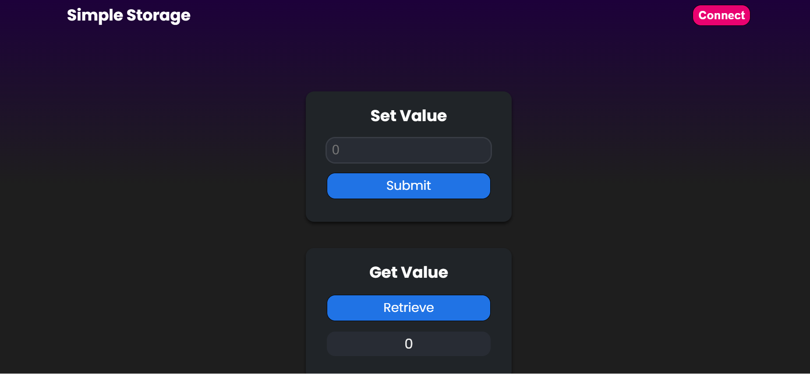

# SimpleStorage Full-Stack DApp

This project is a Full-Stack Decentralized application (DApp) built on Ethereum. It demonstrates how to create, test, deploy, and interact with a smart contract using a modern Web3 development stack.

## 🚀 Tech Stack Used

### 🧠 Smart Contract Layer
- **Solidity** – Used to write the `SimpleStorage` smart contract.
- **Ethereum Virtual Machine (EVM)** – Executes the deployed smart contract logic.

### 🛠 Development Environment
- **Hardhat** – Ethereum development framework used for:
  - Compiling Solidity contracts
  - Running a local blockchain
  - Deploying contracts
  - Writing and running automated tests

### 🔗 Blockchain Interaction
- **Ethers.js** – JavaScript library used in the frontend to:
  - Connect to MetaMask
  - Interact with the deployed smart contract
  - Send transactions and read blockchain data

### 🎨 Frontend
- **React.js** – Used to build the user interface of the DApp.
- **JavaScript (ES6+)** – Application logic and blockchain interaction.
- **CSS** – Basic styling of the UI.

### 🦊 Wallet Integration
- **MetaMask** – Browser extension wallet used to:
  - Connect user accounts
  - Sign transactions
  - Interact with the Ethereum network

### ☁️ Deployment
- **Netlify** – Used to deploy and host the React frontend.
- **Git & GitHub** – Version control and repository hosting.

---

## 📌 Project Overview

The DApp allows users to:
- Connect their Ethereum wallet
- Store a numeric value on the blockchain
- Retrieve the stored value
- View blockchain-related information such as account balance, gas price, and block number

This project demonstrates the complete Web3 workflow:
Smart Contract → Local Blockchain → Frontend Integration → Wallet Connection → Deployment.

---

This repository serves as a beginner-friendly example of building a full-stack Ethereum DApp using modern Web3 development tools.
